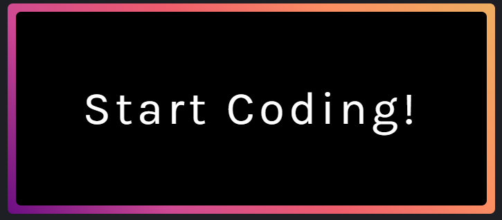

# Button Project

This project is part of the [CSS-PROJECTS](https://github.com/Vansh111000/CSS-PROJECTS) repository and demonstrates creative and interactive button designs using HTML and CSS.

## Overview

The **1-Button** folder showcases a visually appealing button with unique styling and interactive effects. The design leverages advanced CSS techniques to create an engaging user experience.

## Features

- Custom button shape and color
- Smooth hover and active transitions
- Responsive and accessible design
- CSS-only implementation (no JavaScript)

## Usage

1. Clone this repository or download the folder.
2. Open the `index.html` file in your preferred web browser to view the button in action.

## File Structure

- `index.html` – The main HTML file containing the button markup.
- `style.css` (or similar) – The CSS file with all styling rules.
- Images – Screenshots or design references (see above).

## Customization

You can easily modify the button’s color, size, and animation by updating the CSS styles in the respective file.

## Preview

See the screenshot above for a preview of the button’s appearance.

**Image before Hovering**

**Image after hovering**

## License

This project is open-source and available under the [MIT License](../LICENSE).

---
<!--
*Created by [Vansh111000](https://github.com/Vansh111000)*
-->

